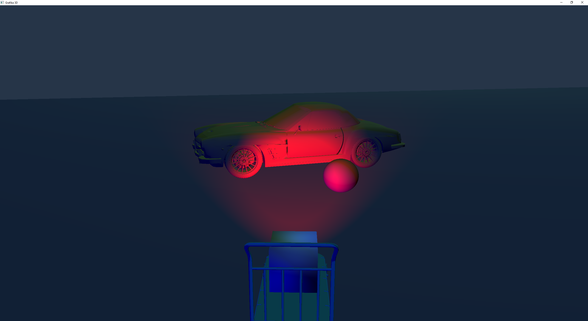

# OpenGL Demo

A program using OpenGL to present basic 3D graphics concepts. Created for Computer Graphics classes at the Warsaw University of Technology, based on learnopengl.com tutorial.

## Technology
Application written in C++, utilizing _OpenGL_ and _Assimp_ libraries. 

Additional dependencies libraries used are: _glfw_ and _zlib_.

## About
Application presents some basic 3D graphics effects with lighting and shading effects implemented with OpenGL library.

Implemented features:
* Perspective created using model, projection and view matrices
* Model loading
* Static and moving objects (translation and rotation)
* Multiple cameras (see section _Manual_)
  * Static (observer) 
  * Tracking (rotating, fixed position, observes the moving object)
  * Following (rotating and moving, follows the moving object)
* Shading models: Phong and Gouraud with dynamic toggling on key press (see section _Manual_)
* Multiple light sources: 
  * Point and directional lights (static)
  * Spotlight placed on a moving object
* Dynamic night/day model
* Lighting models: Phong and Blinn with dynamic toggling on key press (see section _Manual_)

Some of the features are not yet finished and therefore the effects might not be accurate.

## Manual
### Keys:
* __ESC__ - close
    
#### Cameras:
* __1__ - static
* __2__ - tracking (not moving)
* __3__ - following (moving)
    
#### Display mode:
* __Q__ - filled polygons
* __E__ - wireframe of polygons
    
#### Shader:
* __G__ - toggle using Gouraud shading (default Phong)
    
#### Lighting:
* __B__ - toggle using Blinn lightin (default Blinn)
